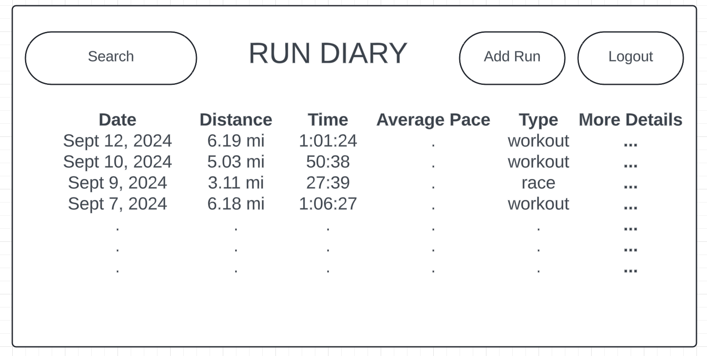

# RUN DIARY
https://startup.rundiary.click

## REACT Deliverable
* **Bundled using Vite**: ✅
* **Components**:
    * Login authentication functionality using local storage.
    * Runs stored on /add and displayed from local storage on /runs.
    * Search functionality to display data from other users on /runs.
    * /stats generates differently depending on which run you navigate from (See More column on /runs).
    * Websocket behavior stubbed on /stats with example comments appearing and ability to comment.
    * Service call stubbed on /stats by displaying example image (will be generated by a service in the future).
* **Router**: Routing between pages from nav bar and various other NavLinks.
* **Hooks**: useState() used in most components to update changes in states, useEffect() on /runs when rendering data and on /stats for generating comments.

## CSS Deliverable
* **Header, footer, and main content body**: All styled and arranged well.
* **Navigation elements**: Restyled navbar to put in top right corner, using both bootstrap framework and some custom styling.
* **Responsive to window resizing**: Used flex to allow display to be responsive and look good on all sizes of windows.
* **Application elements**: Used consistent color scheme, arranging elements in a visually appealing way.
* **Application text content**: Used consistent font family, resizing text to create emphasis.
* **Application images**: Graph image on rundetails page, resized width.

## HTML Deliverable
* **Pages**: 4 pages: home (index.html), login (login.html), form to add new run (newrun.html), and run analytics (rundetails.html)
* **Links**: Home page includes links to all other pages from menu or See More column. Login page links to home when the form is submitted. newrun.html includes a link to home or links to rundetails.html if the form is submitted. rundetails.html includes a link to home.
* **Text**: Textual content is represented on all pages to represent information.
* **Service Calls**: An example graph is displayed on rundetails.html as a placeholder for a call to a service that will generate graphs.
* **Images**: Graph image displayed on rundetails.html
* **Login**: Placeholder of login.html. Username display placeholder on home page.
* **Database**: Example data displayed on index.html is a placeholder for run data that will be stored and extracted from a database.
* **WebSocket**: Comment section on rundetails.html serves as a placeholder for the realtime comments that will be enabled through WebSocket.

## Elevator Pitch
If you consider yourself a runner, you may have found yourself hoping for a simple and quick way to view how your times have improved throughout your workouts and races. **Run Diary** will be your one-stop website for tracking your running statistics. You can categorize each run that you log as a workout or race, and see how it stacks up against previous similar runs. You can also see and interact with your friends's runs!

## Key Features
* Personal login to store all data
* Ability to record the time, distance, type (workout or race), and optional splits of a run
* Comprehensive log of all runs
* Graphs generated comparing times of runs of same type and similar distance
* Ability for users to view other profiles
* Commenting feature to encourage and interact with other user's posted runs

## Design

## Technologies
* **HTML**: Builds well-organized structure. Two pages: run log (comprehensive list of all logged runs) and run analysis (given data and comparitive statistics for one particular run).
* **CSS**: Consistent styling across pages. Good contrast and colors.
* **JavaScript**: Ability to login, move from page to page, generate graphs, visit another user's run log, leave comments.
* **React**: Ease for users to interact with the site, allows frameworks to interact well.
* **Service**: Endpoints for creating a new account, posting a run, generating graphs using [Image-Charts](https://documentation.image-charts.com/).
* **DB/Login**: Login information is securely stored in a database, along with the data for each run that user has logged. The run log can be retreived at each login or if another user visits their log.
* **WebSocket**: Comments on posts are instantly visible, allowing users to interact in real time.

